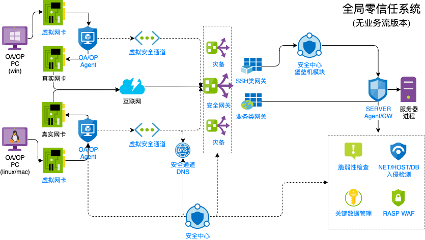

# GlobalZT
GlobalZT全称Global Zero Trust System(全局零信任系统)，是一款帮助企业或业务构建全局零信任网络以及关键位置安全控制措施的开源软件，适用于需要严格控制网络通信信任关系的场景，除通信安全之外，还增加了边界安全、计算环境安全、数据安全模块，探索构建一种业务生命周期中生产阶段、办公接入阶段的安全解决方案.

 

# Status
v0.1编码中，将具备以下功能

- 安全管理中心
    - 基础信息
        - 终端管理
        - 业务管理
        - 业务实例管理
    - 零信任边界
        - 边界集群管理
        - 业务发布
- 零信任客户端
    - 密钥管理
    - 本地登陆界面
    - 虚拟隧道
- 零信任网关
    - 虚拟隧道
    - 业务发布反向代理

每周日晚更新进度，当前进度0%
