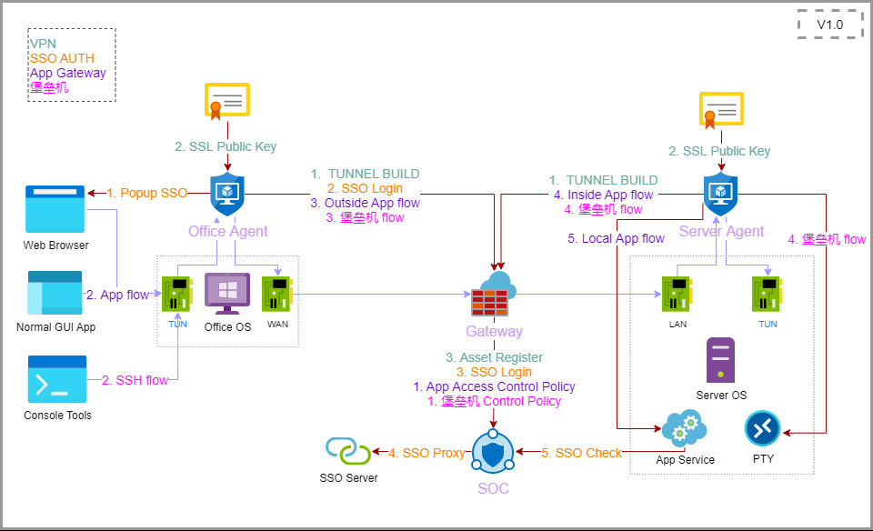
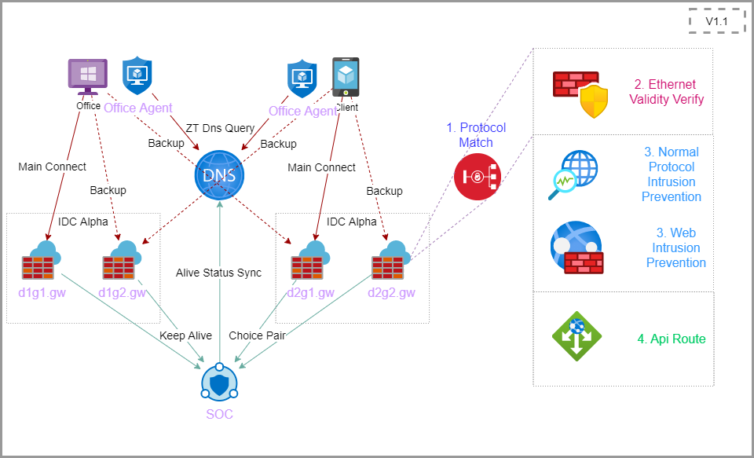
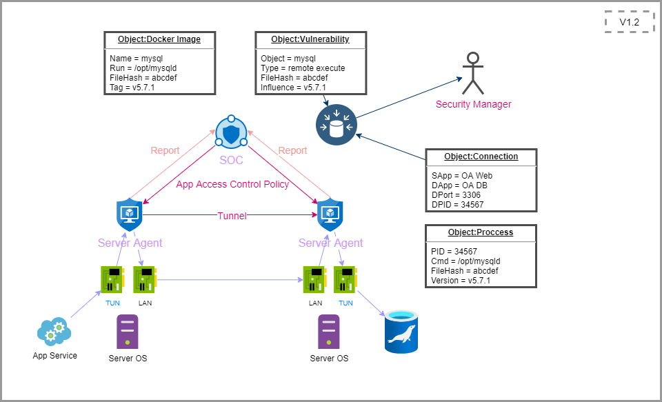

# GlobalZT
GlobalZT [Global Zero Trust System]  
GlobalZT is an open source software that helps enterprises or businesses to build a global zero trust **Network Architecture** and **Access Control Measures**  in the key point of your information system.  
GlobalZT is suitable for scenarios that need to strictly control the network communication trust relationship. In addition to communication security, it also adds **Boundary Security**, **Computing Environment Security** and **Communication Security** to explore the security solution for production phase and office access phase in the business life cycle.
- [CHINESE](https://github.com/userlxd/globalZT/blob/v0.1/README.md)
 

# RoadMap
## v1.0 Application Publishing In Zero Trust
_-> Under development_  
`Based on [VPN SSO Border-Gateway Bastion-Host]`

## V1.1 High Avaliability & Intrustion Prevention For Trust
`Based on [GSLB IPS WAF API-Gateway]`

## V1.2 Continuous Audit & Authentication To Keep Trust
`Based on [Decentralization-Micro-Isolation XDP SOC]`
